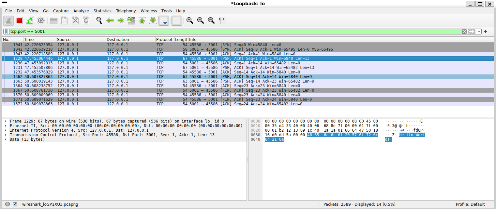

# README_Lab — Cliente TCP con Raw Sockets

Laboratorio: **Cliente TCP con Raw Sockets — Modificación, análisis y visualización de una sesión TCP**  
Archivos modificados: `ClientTCP/src/tcp_client.c`, `ClientTCP/src/tcp_session.c`, `ClientTCP/src/tcp_session.h`, `ClientTCP/Makefile`  
Archivo agregado: `ClientTCP/src/test_log.c`  
Captura de Wireshark: `img/Wireshark.png`  
Servidor de prueba: `ServerTCP.java` — **sin modificar**, tal como indica el enunciado.  

> **Documento complementario:** [`CONCEPTOS_RED.md`](CONCEPTOS_RED.md) explica los fundamentos de redes que este laboratorio ejercita, con los cálculos hechos a mano (checksums con pseudo-header, aritmética de SEQ/ACK, ordenamiento de bytes y encapsulamiento).

---

## Tabla de Contenido

* [1. Qué modificaciones realizó](#1-qué-modificaciones-realizó)
* [2. Cómo funciona la interacción con el usuario](#2-cómo-funciona-la-interacción-con-el-usuario)
* [3. Cómo se genera el output](#3-cómo-se-genera-el-output)
* [4. Qué información TCP muestra el programa](#4-qué-información-tcp-muestra-el-programa)
* [5. Cómo verificó el funcionamiento mediante Wireshark](#5-cómo-verificó-el-funcionamiento-mediante-wireshark)
* [6. Validación de la opción de cierre de conexión](#6-validación-de-la-opción-de-cierre-de-conexión)
* [7. Cómo compilar y ejecutar](#7-cómo-compilar-y-ejecutar)
* [8. Limitaciones conocidas](#8-limitaciones-conocidas)

---

## 1. Qué modificaciones realizó

### 1.1 `tcp_client.c` — Interacción con el usuario (Requerimiento 1)

En la versión original, la función `run_session()` ejecutaba una secuencia fija y lineal: handshake → envío de **un único** mensaje predefinido (`"EXIT OFF"`) → espera del cierre → finalización. Para enviar otro mensaje era necesario reiniciar el programa o modificar el código fuente.

En la versión modificada, `run_session()` mantiene **una sola conexión TCP activa** y ejecuta un ciclo interactivo que permite enviar **$N$ cantidad de mensajes personalizados**:

```c
if (tcp_session_handshake(&session, 10) != 0) { ... }   /* handshake UNA sola vez */

for (;;) {
    /* Pide el mensaje al usuario de manera interactiva */
    printf("\nIngrese un mensaje: ");
    if (read_line(line, sizeof(line)) != 0) break;      /* Ctrl-D: cierre limpio iniciado por cliente */
    if (line[0] == '\0') continue;                      /* Enter vacío: no envía segmento */

    tcp_session_send_message(&session, line);           /* PSH+ACK con los datos del usuario */
    rc = tcp_session_recv(&session, response, ..., 10); /* ACK del servidor y recepción del eco */

    if (is_exit_message(line)) {                        /* Servidor iniciará el cierre */
        tcp_session_recv(&session, NULL, 0, 10);        /* Espera y reconoce su FIN+ACK */
        break;
    }
}

tcp_session_close(&session, 5);                          /* Envía nuestro FIN+ACK y espera ACK final */
```

**Funciones implementadas:**
* `read_line()`: Lee de `stdin` mediante `fgets()` y remueve de forma segura el salto de línea final (`\r` o `\n`) con `strcspn()`. Retorna `-1` al detectar fin de entrada (`EOF` / Ctrl-D).
* `is_exit_message()`: Evalúa `strstr(msg, "EXIT") != NULL`. Replica exactamente la condición de terminación de `ServerTCP.java` (`msg.contains("EXIT")`). Esto permite que el cliente anticipe el cierre del servidor y espere su `FIN+ACK` en lugar de solicitar un nuevo mensaje al usuario.
* **Manejo de argumentos CLI (`-m`):** La bandera `-m` ahora funciona como un atajo para el primer mensaje de la sesión sin bloquear la interactividad posterior. Si no se proporciona `-m`, el cliente inicia directamente en modo interactivo solicitando entrada por consola.

### 1.2 `tcp_session.c` y `tcp_session.h` — Registro y observabilidad de la sesión (Requerimiento 2)

Para cumplir con la visualización detallada de cada segmento:

1. **Campos nuevos en la estructura `tcp_session_t`:**
   ```c
   uint32_t local_isn;   /* ISN del cliente: base para calcular SEQ/ACK relativos */
   uint32_t remote_isn;  /* ISN del servidor: base para calcular SEQ/ACK relativos */
   int      close_logged;/* Evita imprimir duplicado el banner de CLOSE */
   ```
2. **Reemplazo de `tcp_session_drain_until_close()` por `tcp_session_recv()`:**  
   La función original mezclaba en un solo bloque la recepción de datos con el cierre de la conexión. Se modularizó mediante una máquina de estados con el enum `tcp_rx_result_t` (`TCP_RX_TIMEOUT`, `TCP_RX_DATA`, `TCP_RX_FIN`), permitiendo múltiples intercambios de datos en la misma sesión.
3. **Funciones de formateo y visualización:**
   * `flags_to_string()`: Traduce el byte de flags TCP a texto idéntico al mostrado por Wireshark (`[SYN]`, `[SYN, ACK]`, `[PSH, ACK]`, `[FIN, ACK]`), respetando el orden canónico (FIN, SYN, RST, PSH, ACK, URG).
   * `format_data()`: Escapa los bytes de datos para imprimirlos de forma segura en una sola línea (`\n`, `\r`, `\t`, `\"`, `\\` y `\xNN` para no imprimibles), recortando a 64 bytes si excede ese tamaño.
   * `format_segment()`: Ensambla la línea formateada de cada segmento calculando números de secuencia y acuse de recibo **relativos**.
   * `log_segment()`: Imprime la línea formateada en consola con descarga forzada de búfer (`fflush`).
   * `print_banner()` / `print_close_banner()`: Imprimen los encabezados visuales `TCP SESSION`, `DATA`, `CLOSE` y `CONNECTION CLOSED`.
4. **Visibilidad del segmento ACK puro (Paso 5 de la secuencia):**  
   En el código base, los segmentos sin datos y sin FIN se descartaban en silencio (`if (payload_len == 0 && !has_fin) continue;`). Ahora el segmento se registra **antes** de esa validación, logrando que la confirmación intermedia enviada por el servidor sea visible en consola.

### 1.3 `Makefile` + `test_log.c` — Infraestructura de compilación y pruebas

* Se reestructuró el proyecto en carpetas limpias `src/` (fuentes), `build/obj/` (objetos) y `build/bin/` (binarios).
* Se creó `src/test_log.c`, una suite de pruebas unitarias que genera 7 segmentos TCP sintéticos y valida con `assert` el correcto formateo del emisor, receptor, flags, SEQ/ACK relativos, LEN y cadenas escapadas.
* Se agregó la meta `make test` para verificar el formato de salida sin requerir privilegios de superusuario (`sudo`), sockets crudos ni el servidor Java encendido.
* Se agregó la meta `make run` para ejecutar el cliente con manejo automático de `sudo`.
* Se actualizó la regla de compilación para generar una copia directa en `./tcp_client` facilitando la ejecución tradicional.

### 1.4 Qué NO se modificó (el protocolo base sigue intacto)

* **Headers y Checksums:** La estructura de encabezados IPv4 y TCP (`ip_header.c`, `tcp_header.c`), el cálculo de checksums de Internet y del pseudo-header TCP (`checksum.c`) se mantuvieron intactos.
* **Raw Sockets:** La capa de transporte cruda (`raw_socket.c`), `IP_HDRINCL` y los filtros de captura permanecieron sin alteraciones.
* **Servidor de pruebas:** `ServerTCP.java` se mantuvo **completamente intacto**, tal como requería el enunciado.
* **Aritmética TCP:** Se respeta la especificación estricta: SYN consume 1 byte de secuencia, el payload consume `LEN` bytes, y FIN consume 1 byte de secuencia.

---

## 2. Cómo funciona la interacción con el usuario

El cliente establece la conexión una sola vez y permanece escuchando comandos en consola.

```bash
sudo ./tcp_client -l 127.0.0.1 -s 127.0.0.1 -p 5001 -i lo
```

### 2.1 Flujo del ciclo de comunicación

1. **Inicialización:** El programa abre el raw socket, selecciona un puerto efímero aleatorio (rango 40000–49999) y lo imprime en pantalla para configuración del firewall.
2. **Handshake inicial:** Ejecuta el three-way handshake (`SYN` → `SYN, ACK` → `ACK`) **una sola vez**.
3. **Ciclo interactivo:** Muestra el mensaje de solicitud:
   ```text
   Ingrese un mensaje: 
   ```
4. **Transmisión de datos:** El texto introducido se envía dentro de un segmento TCP con banderas `PSH+ACK`.
5. **Recepción y Eco:** El cliente espera y muestra la confirmación (`ACK`) del servidor y el segmento con el eco del mensaje, enviando de vuelta un `ACK` para confirmar su recepción.
6. **Continuidad:** Vuelve inmediatamente al paso 3 sin cerrar la conexión, permitiendo enviar $N$ cantidad de mensajes.

### 2.2 Formas de terminación de la sesión

| Entrada del usuario | Comportamiento en la conexión | Quién inicia el cierre |
|---|---|:---:|
| Texto que contenga `"EXIT"` (p. ej. `EXIT`, `salir EXIT`, etc.) | El servidor responde el eco, cierra su socket y envía `FIN+ACK`. El cliente lo reconoce y envía su propio `FIN+ACK`. | **Servidor (Opción 1)** |
| `"EXIT OFF"` | Igual que el anterior y además el proceso Java del servidor se apaga (`msg.contains("OFF")`). | **Servidor (Opción 1)** |
| **Ctrl-D** (`EOF` / fin de entrada) | El cliente intenta iniciar el cierre enviando `FIN+ACK` (Opción 2). Sin embargo, como se explica en la Sección 6, `ServerTCP.java` no contempla la Opción 2 y arroja `NullPointerException` al recibir `null`, y el archivo no pudo modificarse por restricción de las instrucciones. | **Cliente (Opción 2)** |
| **Enter vacío** | No se genera tráfico de red; el cliente vuelve a mostrar el prompt. | — |

### 2.3 Ejemplo de sesión interactiva con múltiples mensajes

```text
Ingrese un mensaje: Hello World!
Ingrese un mensaje: Hola desde Guatemala
Ingrese un mensaje: EXIT OFF
```

Los tres mensajes viajan a través de la **misma sesión TCP**: existe un único handshake al inicio, tres intercambios de datos en medio, y un único procedimiento de cierre al final.

---

## 3. Cómo se genera el output

### 3.1 Arquitectura del Logger

Cada vez que el programa envía o recibe un segmento relevante, se invoca `log_segment()`, el cual delega la construcción de la cadena en `format_segment()`. Esto garantiza que los mensajes mostrados correspondan directamente a los bytes reales que entraron o salieron de la interfaz de red.

Puntos de registro en el código:
* **`tcp_session_handshake()`:** Registra el `SYN` saliente y el `SYN, ACK` entrante.
* **`send_control()`:** Centraliza y registra el envío de segmentos sin datos (`ACK` del handshake, `ACK` de los datos recibidos, `FIN+ACK` de cierre).
* **`tcp_session_send_message()`:** Registra el segmento `PSH, ACK` con los datos del usuario.
* **`tcp_session_recv()`:** Registra cada segmento TCP entrante que coincide con la 4-tupla de la conexión (incluyendo el `ACK` puro del servidor y el eco).
* **`tcp_session_close()`:** Registra el segmento `FIN+ACK` y el `ACK` final.

### 3.2 Cálculo de SEQ y ACK Relativos

En el medio físico, los números de secuencia iniciales (ISN) son números aleatorios de 32 bits (10 dígitos). Si se mostraran los valores absolutos, la salida sería difícil de interpretar y comparar.

Para resolver esto, el cliente almacena el ISN local (`local_isn`) y el ISN remoto (`remote_isn`) al completar el handshake, calculando los valores relativos de la misma forma en que lo hace Wireshark por defecto:

```c
uint32_t rel_seq = seq - (outgoing ? s->local_isn : s->remote_isn);
uint32_t rel_ack = ack - (outgoing ? s->remote_isn : s->local_isn);
```

* En un segmento **saliente** (`Client → Server`): `SEQ` se calcula restando `local_isn`, mientras que `ACK` (que confirma bytes recibidos) se calcula restando `remote_isn`.
* En un segmento **entrante** (`Server → Client`): `SEQ` se calcula restando `remote_isn`, mientras que `ACK` se calcula restando `local_isn`.

Gracias a esta conversión, tanto en la consola como en Wireshark la sesión comienza con `SEQ=0` y `ACK=1`, permitiendo una correlación directa renglón por renglón.

### 3.3 Formateo y escape de datos (`format_data`)

Los datos se inspeccionan byte por byte. Si un byte corresponde a un carácter no imprimible o de control, se reemplaza por su secuencia de escape:
* Saltos de línea → `\n`, retornos de carro → `\r`, tabulaciones → `\t`.
* Comillas y barras invertidas → `\"`, `\\`.
* Bytes binarios arbitrarios → `\xNN` (código hexadecimal en 2 dígitos).

Esto evita desconfigurar la terminal y hace evidente la presencia del byte `\n` requerido por `ServerTCP.java`.

---

## 4. Qué información TCP muestra el programa

### 4.1 Ejemplo real de salida en consola

```text
[*] Conexión: 127.0.0.1:45586 → 127.0.0.1:5001
[*] Puerto local: 45586  (úselo en la regla de firewall que descarta el RST del kernel)

══════════════════ TCP SESSION ══════════════════
Client → Server  [SYN]        SEQ=0
Server → Client  [SYN, ACK]   SEQ=0      ACK=1
Client → Server  [ACK]        SEQ=1      ACK=1

────────────────── DATA ──────────────────

Ingrese un mensaje: Hello World!
Client → Server  [PSH, ACK]   SEQ=1      ACK=1      LEN=13   DATA="Hello World!\n"
Server → Client  [ACK]        SEQ=1      ACK=14
Server → Client  [PSH, ACK]   SEQ=1      ACK=14     LEN=13   DATA="Hello World!\n"
Client → Server  [ACK]        SEQ=14     ACK=14

Ingrese un mensaje: EXIT OFF
Client → Server  [PSH, ACK]   SEQ=14     ACK=14     LEN=9    DATA="EXIT OFF\n"
Server → Client  [PSH, ACK]   SEQ=14     ACK=23     LEN=9    DATA="EXIT OFF\n"
Client → Server  [ACK]        SEQ=23     ACK=23

────────────────── CLOSE ──────────────────
Server → Client  [FIN, ACK]   SEQ=23     ACK=23
Client → Server  [ACK]        SEQ=23     ACK=24
Client → Server  [FIN, ACK]   SEQ=23     ACK=24
Server → Client  [ACK]        SEQ=24     ACK=24

══════════════════ CONNECTION CLOSED ══════════════════
```

### 4.2 Desglose de campos mostrados en consola

| Campo | Significado en el protocolo | Origen y justificación |
|---|---|---|
| `Client → Server` / `Server → Client` | **Sentido y extremos del segmento.** | Determinado por la dirección del paquete (`outgoing` en `format_segment()`). |
| `[SYN]`, `[SYN, ACK]`, `[PSH, ACK]`, etc. | **Banderas TCP activas.** | Generadas por `flags_to_string()` evaluando la máscara de bits en el encabezado TCP, en el orden estándar de Wireshark. |
| `SEQ=` | **Número de secuencia relativo.** | `seq - ISN_origen`. Indica la posición del primer byte de datos del segmento en el flujo del emisor. |
| `ACK=` | **Número de acuse de recibo relativo.** | `ack - ISN_destino`. Indica el siguiente byte que se espera recibir del otro extremo. Solo se muestra si la bandera ACK está encendida. |
| `LEN=` | **Longitud del payload TCP (datos).** | Tamaño total del segmento IP menos los encabezados IP y TCP. Solo se muestra si el segmento transporta datos ($LEN > 0$). |
| `DATA="..."` | **Contenido del payload escapado.** | Representación legible del mensaje enviado o recibido en una sola línea. |

### 4.3 Elementos adicionales de observabilidad

* **Separadores de fase:** Banners delimitadores (`TCP SESSION`, `DATA`, `CLOSE`, `CONNECTION CLOSED`) que permiten identificar instantáneamente la etapa de la conexión y quién tomó la iniciativa en el cierre.
* **Detección de desorden / retransmisiones:** Si llega un segmento cuyo `SEQ` no coincide con el `ACK` esperado, el programa muestra una advertencia en consola: `(fuera de orden o retransmisión: se esperaba SEQ=N)` y responde con un `ACK` redundante para estabilizar la sesión.
* **Cálculo de longitud `LEN`:** `"Hello World!"` contiene 12 caracteres visibles. Al enviarse, `tcp_session_send_message()` adjunta un salto de línea (`\n`) para satisfacer el `readLine()` del servidor Java. Por ello, el segmento viaja con `LEN=13` y el número `SEQ` subsiguiente avanza en 13 unidades ($1 + 13 = 14$).

---

## 5. Cómo verificó el funcionamiento mediante Wireshark

### 5.1 Procedimiento de captura

1. Iniciar Wireshark o `tcpdump` sobre la interfaz de loopback (`lo` en Linux, `lo0` en macOS) antes de ejecutar el cliente:
   ```bash
   sudo tcpdump -i lo -nn -w captura_sesion.pcap "tcp port 5001"
   ```
2. Configurar el filtro de visualización en Wireshark:
   ```text
   tcp.port == 5001
   ```
3. Verificar que Wireshark tenga activada la opción **Relative sequence numbers** en:  
   *Edit → Preferences → Protocols → TCP → Relative sequence numbers* (habilitada por defecto).
4. Ejecutar el servidor Java y el cliente en consolas separadas, enviar al menos dos mensajes (`Hello World!`, luego `EXIT OFF`).
5. Detener la captura y analizar los paquetes.

### 5.2 Correspondencia de campos entre Consola y Wireshark

| Campo en la Consola | Campo en Wireshark | Observación |
|---|---|---|
| `Client → Server` / `Server → Client` | Columnas *Source* / *Destination* y puertos | Comprueba qué extremo originó el frame. |
| `[SYN]`, `[SYN, ACK]`, `[PSH, ACK]`, etc. | Columna *Info* (flags entre corchetes) | Nomenclatura y orden idénticos a Wireshark. |
| `SEQ=N` | Campo `Seq=N` en columna *Info* y árbol de detalle | Coincidencia exacta 1:1 gracias al cálculo relativo. |
| `ACK=N` | Campo `Ack=N` en columna *Info* y árbol de detalle | Coincidencia exacta 1:1. |
| `LEN=N` | Campo `Len=N` en columna *Info* | Tamaño de datos de aplicación sin headers. |
| `DATA="Hello World!\n"` | Menú contextual → *Follow → TCP Stream* o panel de bytes | Muestra la carga útil exacta transmitida. |

### 5.3 Fenómenos de red observados

1. **Piggybacking del ACK del servidor:** En entornos de loopback, el kernel del servidor puede acoplar la confirmación de recepción (`ACK`) con el segmento de eco (`PSH, ACK`) en un solo paquete, reduciendo el total de frames observados.
2. **Checksum Incorrect del kernel en loopback:** En Wireshark, los segmentos del servidor Java pueden marcarse como `[TCP Checksum Incorrect]`. Esto se debe al *Checksum Offloading* de la tarjeta de red virtual del sistema operativo. Por el contrario, los segmentos generados por nuestro cliente en `checksum.c` siempre muestran checksum válido, validando el cálculo manual del algoritmo.
3. **Bloqueo del RST del Kernel:** Dado que el cliente opera fuera del stack TCP del sistema operativo, el firewall (`iptables`) descarta exitosamente los `RST` que el kernel genera al recibir el `SYN, ACK`, permitiendo que el cliente RAW complete el handshake.

### 5.4 Análisis detallado de la captura incluida (`img/Wireshark.png`)

En el repositorio se incluye la captura de pantalla [`img/Wireshark.png`](img/Wireshark.png), obtenida durante la ejecución en loopback con el cliente en el puerto efímero `45586` y el servidor en el puerto `5001`:



#### Desglose de los 14 paquetes de la captura:

1. **Three-Way Handshake (Paquetes 1041 – 1043):**
   * **Pkt 1041 (Cliente → Servidor):** `[SYN] Seq=0 Len=0`. El cliente propone la conexión.
   * **Pkt 1042 (Servidor → Cliente):** `[SYN, ACK] Seq=0 Ack=1 Len=0`. El servidor acepta y acusa el byte del SYN.
   * **Pkt 1043 (Cliente → Servidor):** `[ACK] Seq=1 Ack=1 Len=0`. Conexión formalmente establecida.
2. **Mensaje 1 — `"Hello World!"` (Paquetes 1229 – 1232):**
   * **Pkt 1229 (Cliente → Servidor):** `[PSH, ACK] Seq=1 Ack=1 Len=13`. Frame seleccionado en la captura; en el panel inferior se observa la representación ASCII y hexadecimal: `48 65 6c 6c 6f 20 57 6f 72 6c 64 21 0a` (`"Hello World!\n"`).
   * **Pkt 1230 (Servidor → Cliente):** `[ACK] Seq=1 Ack=14 Len=0`. El servidor acusa los 13 bytes recibidos ($1 + 13 = 14$).
   * **Pkt 1231 (Servidor → Cliente):** `[PSH, ACK] Seq=1 Ack=14 Len=13`. El servidor devuelve el eco del mensaje.
   * **Pkt 1232 (Cliente → Servidor):** `[ACK] Seq=14 Ack=14 Len=0`. El cliente confirma la recepción del eco.
3. **Mensaje 2 — `"EXIT OFF"` (Paquetes 1362 – 1364):**
   * **Pkt 1362 (Cliente → Servidor):** `[PSH, ACK] Seq=14 Ack=14 Len=9 Data="EXIT OFF\n"`.
   * **Pkt 1363 (Servidor → Cliente):** `[PSH, ACK] Seq=14 Ack=23 Len=9`. El servidor realiza *piggybacking*: confirma en un solo paquete los 9 bytes del cliente ($14 + 9 = 23$) y reenvía el eco de `"EXIT OFF\n"`.
   * **Pkt 1364 (Cliente → Servidor):** `[ACK] Seq=23 Ack=23 Len=0`. El cliente confirma el eco.
4. **Cierre de Conexión — Opción 1 iniciada por el Servidor (Paquetes 1367 – 1372):**
   * **Pkt 1367 (Servidor → Cliente):** `[FIN, ACK] Seq=23 Ack=23 Len=0`. El servidor lee `EXIT`, invoca `client.close()` y envía el primer FIN.
   * **Pkt 1370 (Cliente → Servidor):** `[ACK] Seq=23 Ack=24 Len=0`. El cliente acusa el byte del FIN ($23 + 1 = 24$).
   * **Pkt 1371 (Cliente → Servidor):** `[FIN, ACK] Seq=23 Ack=24 Len=0`. El cliente envía su propio FIN.
   * **Pkt 1372 (Servidor → Cliente):** `[ACK] Seq=24 Ack=24 Len=0`. El servidor confirma el FIN del cliente ($23 + 1 = 24$). Conexión cerrada.

---

## 6. Validación de la opción de cierre de conexión

> **Requerimiento del enunciado:** Validar qué opción de cierre de conexión está realizando el código proporcionado.

### Conclusión: El código realiza la **Opción 1** (cierre iniciado por el servidor).

#### Evidencia técnica:

1. **Comportamiento de `ServerTCP.java` (diseñado exclusivamente para Opción 1):**
   ```java
   while (true) {
       msg = in.readLine();
       out.println(msg);
       System.out.println("Message: " + msg);
       if (msg.contains("EXIT")) { break; } // Sale del ciclo únicamente si contiene "EXIT"
   }
   client.close(); // <-- Genera inmediatamente el segmento FIN del servidor
   ```
   En cuanto el servidor recibe una línea con la palabra `"EXIT"`, sale de su bucle y ejecuta `client.close()`. Esto provoca que el kernel del servidor envíe el primer segmento `FIN+ACK` (paso 8 de la secuencia).

2. **Comportamiento del cliente en `tcp_session.c`:**
   * En el código base, `run_session()` llamaba a `tcp_session_drain_until_close()` **antes** de llamar a `tcp_session_close()`.
   * `tcp_session_drain_until_close()` quedaba en espera del segmento `FIN` del servidor, le enviaba un `ACK` de respuesta, y recién entonces retornaba para que `tcp_session_close()` enviara el `FIN+ACK` del cliente.
   * La secuencia es:
     1. Servidor → Cliente: `FIN + ACK` (Pkt 1367 en la captura)
     2. Cliente → Servidor: `ACK`       (Pkt 1370 en la captura)
     3. Cliente → Servidor: `FIN + ACK` (Pkt 1371 en la captura)
     4. Servidor → Cliente: `ACK`       (Pkt 1372 en la captura)
   * Esta corresponde de manera idéntica a la **Opción 1** descrita en el enunciado.

### 6.1 Por qué la Opción 2 no funciona en `ServerTCP.java` y no pudo modificarse

El enunciado del laboratorio también menciona la existencia de una **Opción 2** (cierre iniciado por el cliente enviando `FIN+ACK` primero). Sin embargo:

1. **`ServerTCP.java` no contempla la Opción 2:**  
   Si el cliente intenta cerrar primero la conexión (por ejemplo, enviando `FIN+ACK` al presionar Ctrl-D sin haber enviado `"EXIT"`), el canal de lectura del servidor recibe un fin de flujo (`EOF`). En Java, `in.readLine()` devuelve `null` al llegar al fin de flujo.  
   Como se observa en el código fuente de `ServerTCP.java`, el servidor **no valida si `msg == null`**:
   ```java
   msg = in.readLine();                 // Devuelve null ante un FIN del cliente
   out.println(msg);                    // Imprime "null"
   System.out.println("Message: " + msg);
   if (msg.contains("EXIT")) { break; } // <-- ¡Lanza java.lang.NullPointerException!
   ```
   Al intentar evaluar `.contains("EXIT")` sobre una referencia `null`, la máquina virtual de Java lanza inmediatamente una excepción no controlada:
   ```text
   Exception in thread "main" java.lang.NullPointerException: Cannot invoke "String.contains(java.lang.CharSequence)" because "msg" is null
           at ServerTCP.main(ServerTCP.java:19)
   ```
   Como resultado de esta excepción, el servidor colapsa abruptamente sin ejecutar jamás `client.close()`, lo que impide que envíe su respectivo `FIN+ACK` para completar el cierre de la Opción 2 de forma ordenada según el estándar TCP.

2. **No fue posible modificar `ServerTCP.java` debido a las restricciones del enunciado:**  
   En la página 1 del PDF del laboratorio (*Laboratorio TCP RAW.pdf*), las instrucciones especifican explícitamente:
   > *"El estudiante debe trabajar principalmente sobre: `tcp_client.c` y `tcp_session.c`"*  
   > *"No se requiere modificar la implementación del servidor para cumplir con los requisitos principales de esta tarea."*  

   Dado que la directiva indicaba claramente no modificar el código del servidor, **se mantuvo `ServerTCP.java` intacto**, documentando esta limitación técnica y garantizando que la sesión opere bajo la **Opción 1**, que es la única implementada y soportada funcionalmente por el servidor provisto.

---

## 7. Cómo compilar y ejecutar

### 7.1 Estructura del proyecto y targets del Makefile

El directorio `ClientTCP` está organizado de la siguiente manera:
* `src/`: Archivos de código fuente (`.c`) y encabezados (`.h`).
* `build/obj/`: Archivos objeto intermedios (`.o`).
* `build/bin/`: Ejecutables compilados (`tcp_client`, `test_log`).
* `tcp_client`: Copia directa del binario en la raíz de `ClientTCP/` para ejecución rápida.

El `Makefile` ofrece los siguientes comandos:

| Comando | Descripción | Requiere privilegios (`sudo`) |
|---|---|:---:|
| `make` (o `make all`) | Compila todos los módulos, genera `build/bin/tcp_client` y copia `./tcp_client`. | No |
| `make run [ARGS="..."]` | Ejecuta el cliente, detectando automáticamente si se requiere `sudo`. Admite argumentos en `ARGS`. | Sí (se invoca solo) |
| `make test` | Compila y ejecuta la suite unitaria de validación de formato de logs (7 pruebas de segmento). | No |
| `make clean` | Elimina la carpeta `build/`, los objetos `.o` y los ejecutables creados. | No |

### 7.2 Compilación

```bash
cd ClientTCP
make clean && make          # Compila el cliente TCP
javac ../ServerTCP.java     # Compila el servidor Java de prueba
```

Verificación automática del formato de log (Requerimiento 2):
```bash
make test
```

### 7.3 Regla obligatoria de Firewall

Como el cliente genera paquetes artesanalmente con raw sockets sin usar `connect()`, el kernel del sistema operativo local no reconoce la conexión y responderá con un paquete `RST` que corta el handshake. Es indispensable descartar esos `RST` salientes para el rango de puertos efímeros del cliente (40000 a 49999):

**En Linux (`iptables`):**
```bash
sudo iptables -A OUTPUT -p tcp --sport 40000:49999 --tcp-flags RST RST -j DROP

# Al finalizar la práctica, eliminar la regla con:
sudo iptables -D OUTPUT -p tcp --sport 40000:49999 --tcp-flags RST RST -j DROP
```

**En macOS (`pfctl`):**
```bash
echo 'block drop out proto tcp from any port 40000:49999 flags R/R' | sudo pfctl -f -
sudo pfctl -e

# Al finalizar, restaurar la configuración con:
sudo pfctl -f /etc/pf.conf
```

### 7.4 Ejecución paso a paso

**Terminal 1 — Iniciar el servidor:**
```bash
# Desde la raíz de lab05 donde está ServerTCP.class
java ServerTCP
```

**Terminal 2 — Iniciar el cliente:**
* **Vía `make run`:**
  ```bash
  cd ClientTCP
  make run ARGS="-l 127.0.0.1 -s 127.0.0.1 -p 5001 -i lo"
  ```
* **O vía binario directo:**
  ```bash
  cd ClientTCP
  sudo ./tcp_client -l 127.0.0.1 -s 127.0.0.1 -p 5001 -i lo
  ```

---

## 8. Limitaciones conocidas

El cliente tiene fines didácticos y mantiene las limitaciones conceptuales del diseño base:
* **Sin retransmisiones automáticas:** Si un paquete se pierde en la red física, la conexión finaliza por timeout.
* **Sin control de congestión ni ventana deslizante:** Los segmentos asumen capacidad en el receptor sin ajustar dinámicamente la ventana anunciada.
* **Sin opciones TCP:** La cabecera TCP tiene un tamaño fijo de 20 bytes (sin MSS, SACK ni Window Scaling).
* **Sin estado TIME_WAIT:** Al recibir el último ACK, el proceso finaliza inmediatamente liberando los recursos del socket crudo.
* **Tamaño de mensaje:** Los mensajes se limitan a 1023 bytes por segmento (sin segmentación a nivel de aplicación).
* **Sin IP Spoofing:** La dirección IP origen debe pertenecer a una interfaz real del host.
